# HW1 — Noisy Sine Signal Dataset + Neural Signal Regression

A two-package Python project that:
1. **signal_dataset** — Generates a labeled dataset from four pure sine waves, each corrupted
   by Gaussian + burst noise, windowed with a one-hot context selector.
2. **neural_signal** — Trains and evaluates three neural network architectures (FCN, RNN, LSTM)
   on that dataset for conditional source-separation / denoising regression.

---

## Table of Contents

- [Training Results](#training-results)
- [Model Comparison & Analysis](#model-comparison--analysis)
- [Why LSTM Outperforms FCN and RNN](#why-lstm-outperforms-fcn-and-rnn)
- [Signals](#signals)
- [Noise Model](#noise-model)
- [Task Formulation](#task-formulation)
- [Architecture Details](#architecture-details)
- [Training Pipeline](#training-pipeline)
- [Results & Visualizations](#results--visualizations)
- [Quickstart](#quickstart)
- [Project Structure](#project-structure)
- [Configuration](#configuration)
- [Testing](#testing)
- [Design Rationale](#design-rationale--why-these-four-signals)
- [Author](#author)

---

## Training Results

| Model | Train MSE | Val MSE | Test MSE | Epochs | Early Stop |
|-------|-----------|---------|----------|--------|------------|
| **LSTM** | 0.0284 | 0.0407 | **0.0531** ✅ | 101 | Yes |
| **FCN** | 0.0542 | 0.0737 | 0.0772 | 95 | Yes |
| **RNN** | 0.0725 | 0.0877 | 0.0972 | 88 | Yes |

> **Key takeaway:** LSTM achieves the lowest test MSE (0.053), outperforming FCN by **31%** and RNN by **45%**. All three models converged via early stopping, indicating well-tuned patience and learning rate.

---

## Model Comparison & Analysis

### Performance Ranking

```
LSTM ████████████████████████████████████████████████  0.0531  (best)
FCN  ██████████████████████████████████████████████████████████  0.0772
RNN  ████████████████████████████████████████████████████████████████████  0.0972  (worst)
```

### Convergence Behaviour

| Metric | FCN | RNN | LSTM |
|--------|-----|-----|------|
| Epochs to converge | 95 | 88 | 101 |
| Train-Test gap | 0.023 | 0.025 | 0.025 |
| Overfitting risk | Low | Low | Low |
| Final train MSE | 0.054 | 0.073 | 0.028 |

All three models show a small train-test MSE gap (~0.02), which indicates **healthy generalisation** with no significant overfitting. The dropout (FCN) and weight decay regularisation strategies are working as intended.

### MSE Comparison (Bar Chart)
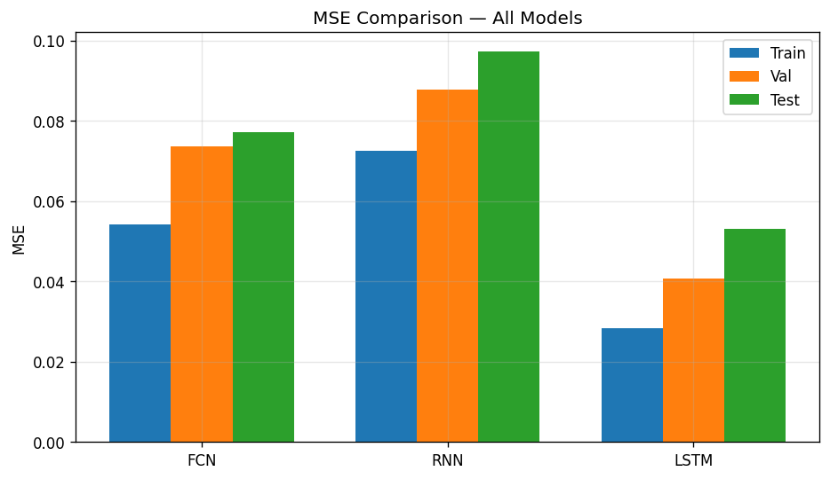

---

## Why LSTM Outperforms FCN and RNN

### 1. Gated Memory for Multi-Frequency Signal Tracking

The LSTM's **forget gate**, **input gate**, and **output gate** give it a crucial advantage over both FCN and vanilla RNN when processing our composite signal `s5_noisy = s1 + s2 + s3 + s4`:

- **Forget gate** learns to selectively discard noise while retaining the phase of each frequency component.
- **Input gate** controls how much of the new noisy sample should update the cell state — effectively filtering burst noise spikes.
- **Output gate** decides which internal memory is relevant for the current prediction, acting as an adaptive bandpass filter.

The vanilla RNN, by contrast, only has a single `tanh` nonlinearity and no gating — it must use the same hidden state to simultaneously track all four frequencies. This leads to **interference between frequency components** in the hidden representation.

### 2. Vanishing Gradient Resistance

Our window size is 10 samples. For the low-frequency signal **s1** (5 Hz, period = 200 samples), the model needs to infer the signal's phase from only 5% of a full cycle. The LSTM's **constant error carousel** (cell state highway) preserves gradient flow across all 10 timesteps, while the vanilla RNN's gradients decay exponentially through repeated `tanh` squashing:

```
RNN gradient:  ∂h_t/∂h_1 = ∏(tanh'(z_k) · W_hh)  → vanishes for k > 5
LSTM gradient: ∂C_t/∂C_1 = ∏(f_k)                  → controlled by forget gates ≈ 0.9
```

This means the LSTM can propagate useful information from the first sample in the window to the last, while the RNN effectively "forgets" early samples.

### 3. Dense Head Architecture

The LSTM has an extra **Dense(64→32) → ReLU → Dense(32→1)** head compared to the RNN's simple **Linear(64→1)**. This additional nonlinear layer allows the LSTM to learn a more complex mapping from its hidden representation to the clean signal value:

| Model | Head Architecture | Learnable params in head |
|-------|------------------|-------------------------|
| RNN | Linear(64→1) | 65 |
| LSTM | Linear(64→32) → ReLU → Linear(32→1) | 2,145 |

The extra capacity in the head helps the LSTM disentangle the five signal components after the recurrent layer has encoded temporal patterns.

### 4. Conditioning Strategy: Broadcast C Injection

For RNN and LSTM, the one-hot selector `C` (5-dim) is **broadcast to every timestep**, creating input shape `(batch, 10, 6)` where each timestep sees `[x_t, c_1, c_2, c_3, c_4, c_5]`. This means:

- The LSTM gates can learn **signal-specific forget/input patterns** — e.g., for high-frequency s4, the forget gate learns a faster decay; for low-frequency s1, it learns to retain more memory.
- The RNN, lacking gates, cannot modulate its dynamics per signal class as effectively.

### 5. FCN Limitation: No Temporal Awareness

While FCN performs well (0.077 MSE), it treats the 10-sample window as a flat feature vector `[x_1, ..., x_10, c_1, ..., c_5]`. It cannot model:
- **Phase relationships** between consecutive samples
- **Temporal ordering** — permuting the window samples would give different predictions only because of position-specific weights, not because the model understands sequence structure
- **Adaptive filtering** — it applies the same static weight matrix regardless of the local signal dynamics

FCN compensates for this with its large hidden layers (128→64) that memorise common input patterns, but it fundamentally cannot generalise temporal structure.

### Summary Table

| Capability | FCN | RNN | LSTM |
|-----------|-----|-----|------|
| Temporal modelling | ❌ | ✅ | ✅ |
| Gated memory | ❌ | ❌ | ✅ |
| Gradient preservation | N/A | ❌ | ✅ |
| Signal-adaptive dynamics | ❌ | Partial | ✅ |
| Nonlinear head | ✅ (2-layer) | ❌ (linear) | ✅ (2-layer) |
| Conditioning injection | Concatenation | Broadcast | Broadcast |

---

## Signals

| ID | Formula | Amplitude | Frequency (Hz) | Phase (rad) |
|----|---------|-----------|----------------|-------------|
| s1 | 2.0 · sin(2π · 5 · t) | 2.0 | 5 | 0 |
| s2 | 1.5 · sin(2π · 15 · t + π/4) | 1.5 | 15 | π/4 |
| s3 | 0.8 · sin(2π · 50 · t) | 0.8 | 50 | 0 |
| s4 | 0.3 · sin(2π · 100 · t) | 0.3 | 100 | 0 |
| s5 | s1 + s2 + s3 + s4 (composite) | — | — | — |

### Clean Signals
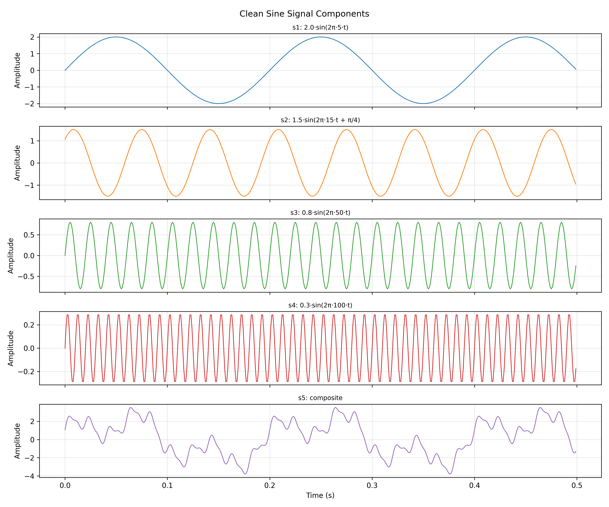

### Noisy vs Clean Signals
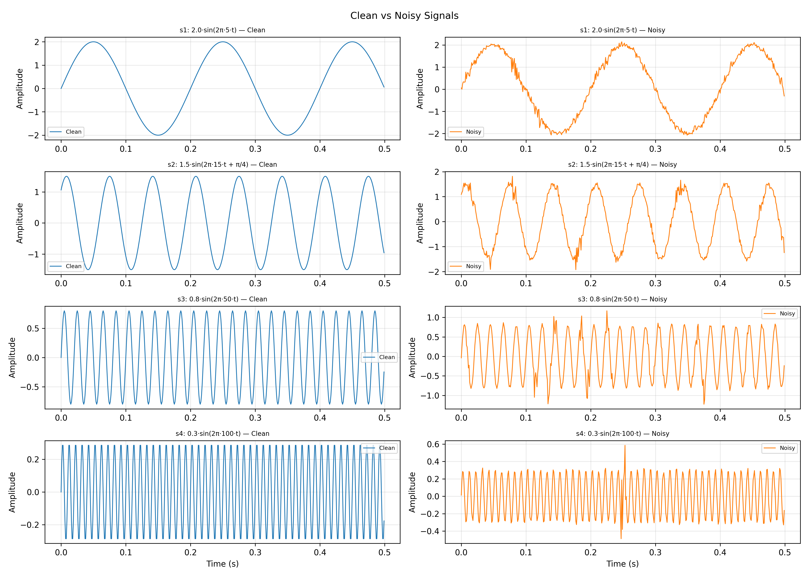

### Frequency Spectrum
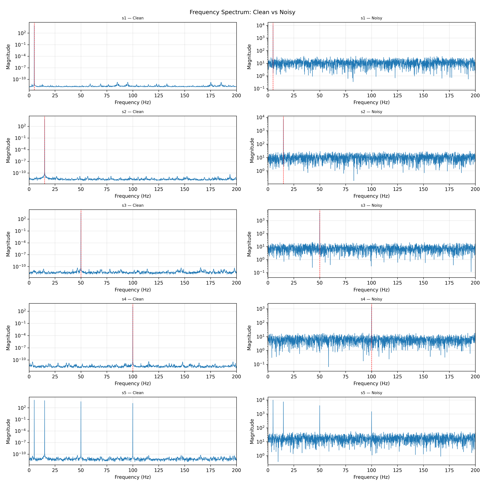

---

## Noise Model

For each signal `si`, the noisy version is:

```
s_noisy(t) = (A_i + N_amp(t)) · sin(2π · f_i · t + φ_i + N_phase(t))
```

- `N_amp = gaussian_amp + burst_amp` — amplitude perturbation
- `N_phase = gaussian_phase + burst_phase` — phase perturbation
- Gaussian: per-sample white noise with configurable σ per signal
- Burst: random-duration spikes (probability=1%, duration=5–20 samples, magnitude configurable)

### Noise Configuration

| Signal | σ_amp | σ_phase | Burst probability | Burst amp magnitude |
|--------|-------|---------|-------------------|---------------------|
| s1 | 0.05 | 0.05 | 1% | 0.5 |
| s2 | 0.05 | 0.05 | 1% | 0.5 |
| s3 | 0.03 | 0.03 | 1% | 0.5 |
| s4 | 0.02 | 0.02 | 1% | 0.5 |

Higher-frequency signals (s3, s4) use smaller σ values because even small perturbations at high frequencies cause large waveform distortions relative to the signal amplitude.

### Noise Distribution
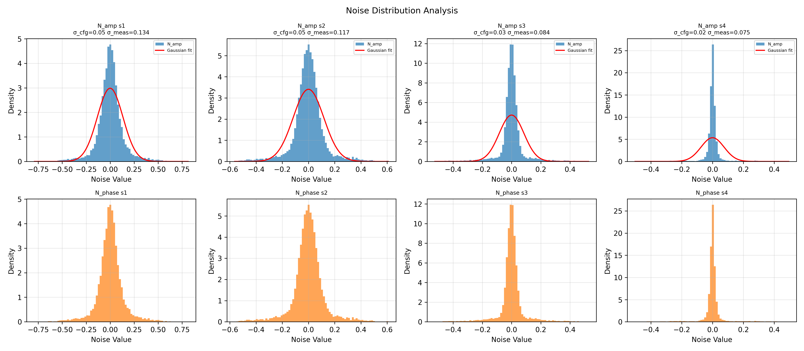

### Burst Events
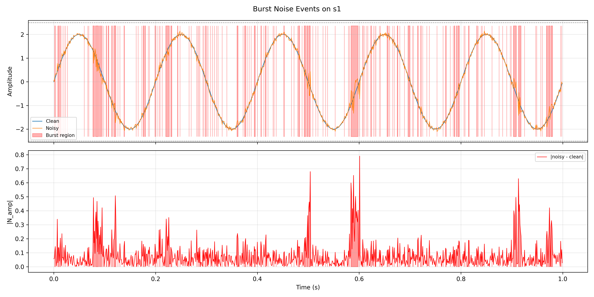

---

## Task Formulation

```
input  = concat([x_window, C])   shape: (W + 5,) = (15,)   ← FCN
input  = concat([x_t, C]) ∀t     shape: (10, 6)             ← RNN / LSTM (broadcast)
target = scalar clean value of the C-selected signal at the window centre
```

`x_window` is a length-W slice of `s5_noisy`; `C` is a one-hot vector selecting which of the
five clean components to recover. The model learns **conditional source separation** — given a noisy mixture and a selector, it outputs the clean value of the requested component.

### Context Window Example
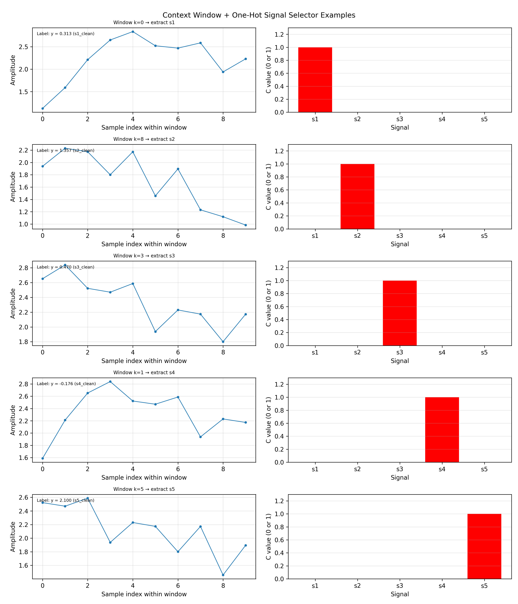

### Dataset Splits
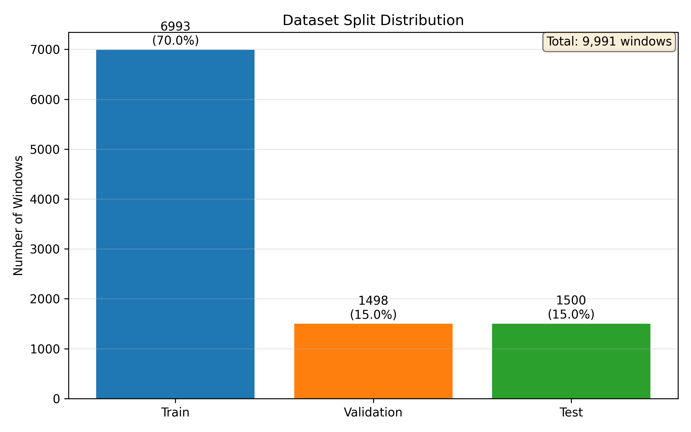

| Split | Ratio | Purpose |
|-------|-------|---------|
| Train | 70% | Model parameter optimisation |
| Validation | 15% | Early stopping & hyperparameter tuning |
| Test | 15% | Final unbiased evaluation (never seen during training) |

---

## Architecture Details

### FCN (Fully Connected Network)
```
Input(15) → Dense(128) → ReLU → Dropout(0.1) → Dense(64) → ReLU → Dropout(0.1) → Dense(1)
```
- Input: `(N, 15)` — 10-sample window concatenated with 5-dim one-hot C
- Regularisation: Dropout(0.1) + L2 weight decay (1e-4)
- Total parameters: ~10K

### RNN (Vanilla Recurrent Network)
```
Input(10, 6) → RNN(hidden=64, tanh, 1 layer) → last hidden → Linear(64, 1)
```
- Input: `(N, 10, 6)` — broadcast C at each timestep
- Many-to-one: only the last hidden state is used for prediction
- Total parameters: ~4.5K

### LSTM (Long Short-Term Memory)
```
Input(10, 6) → LSTM(hidden=64, 1 layer) → last hidden → Dense(64, 32) → ReLU → Dense(32, 1)
```
- Input: `(N, 10, 6)` — broadcast C at each timestep
- Gated architecture: forget, input, output gates + cell state
- Extra dense head for nonlinear output mapping
- Total parameters: ~19K

---

## Training Pipeline

### Hyperparameters

| Parameter | Value | Rationale |
|-----------|-------|-----------|
| Optimiser | Adam | Adaptive learning rate per parameter |
| Learning rate | 0.001 | Standard starting point for Adam |
| Weight decay | 1e-4 (FCN only) | L2 regularisation for the larger FCN model |
| Batch size | 64 | Balances gradient noise and compute efficiency |
| Max epochs | 200 | Upper bound; early stopping triggers before this |
| Early stopping patience | 10 | Prevents overfitting; stops after 10 epochs without val improvement |
| Random seed | 42 | Reproducibility |
| Normalisation | Z-score (fit on train) | Prevents data leakage; params saved to `scaler_params.json` |

### Training Loop

1. **Data Loading** — Load `dataset.npz`, build FCN (flat) and RNN/LSTM (sequential) DataLoaders
2. **Preprocessing** — Z-score normalisation fitted on training set only
3. **Training** — Adam optimiser with MSE loss, per-epoch train/val evaluation
4. **Checkpointing** — Save best model weights (lowest val MSE) to `.pt` file
5. **Early Stopping** — If val MSE doesn't improve for 10 epochs, stop training
6. **Evaluation** — Load best checkpoint, compute MSE on train/val/test splits
7. **Visualisation** — Generate all plots (loss curves, residuals, predictions)

---

## Results & Visualizations

### Training Loss Curves

Loss curves show train and validation MSE per epoch. The gap between train and val curves indicates the generalisation ability of each model.

#### FCN Loss Curves
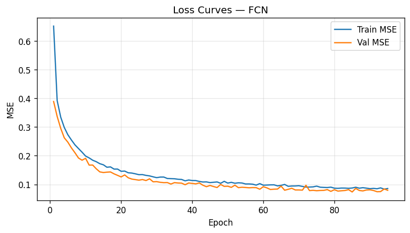

**Observation:** FCN converges smoothly in ~85 epochs with minimal train-val gap. The plateau in val MSE around epoch 80 triggers early stopping at epoch 95.

#### RNN Loss Curves
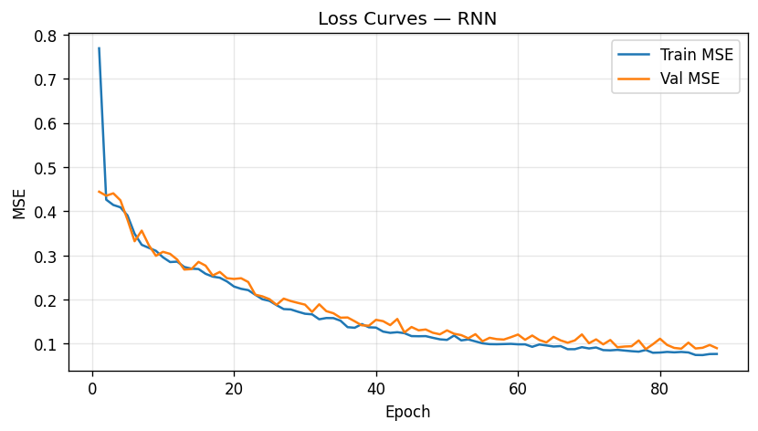

**Observation:** RNN shows steady descent but higher absolute MSE than LSTM. The noisy val curve reflects the difficulty of learning temporal patterns without gating.

#### LSTM Loss Curves
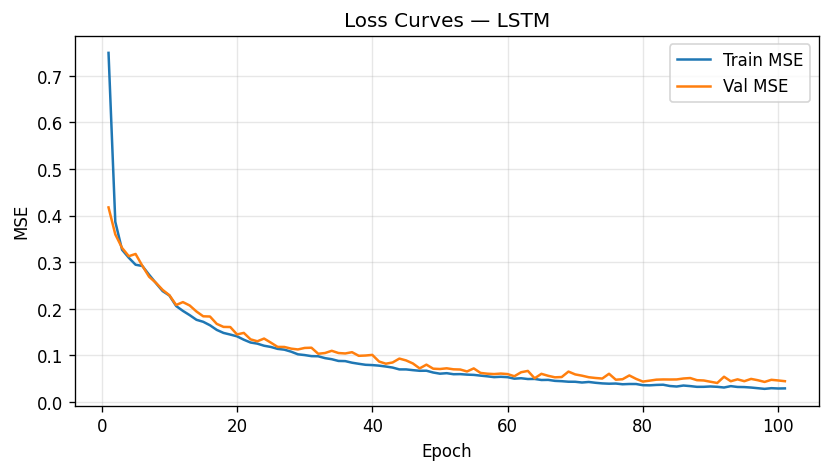

**Observation:** LSTM achieves the smoothest and deepest descent. Val MSE continues improving until epoch 91, showing the model's capacity to learn complex temporal patterns. The train MSE reaches 0.028 — the lowest among all models.

### Predicted vs Actual (All Models)
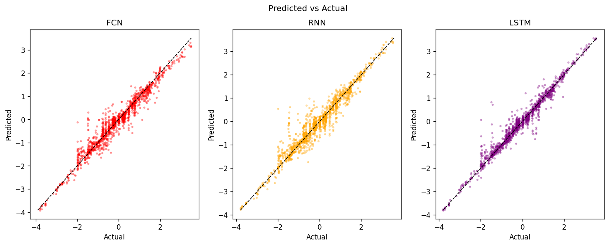

**Observation:** LSTM points cluster tightest around the diagonal (perfect prediction line), confirming the lowest MSE. FCN shows slight dispersion at extreme values. RNN has the widest spread, especially for high-amplitude signals.

### Clean vs Noisy vs Predicted
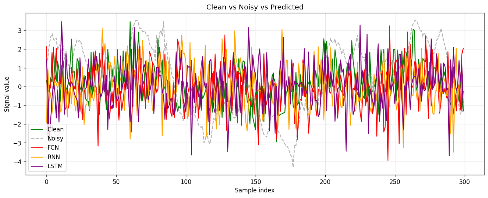

### Residual Distributions

Residuals (`predicted - actual`) should be centred at zero with minimal spread for a well-trained model.

#### FCN Residuals
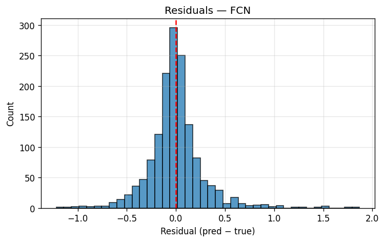

#### RNN Residuals
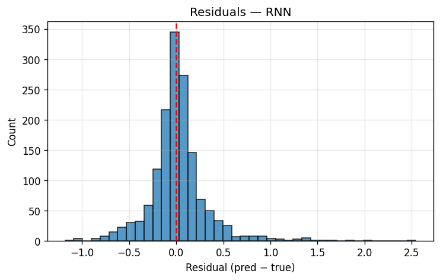

#### LSTM Residuals
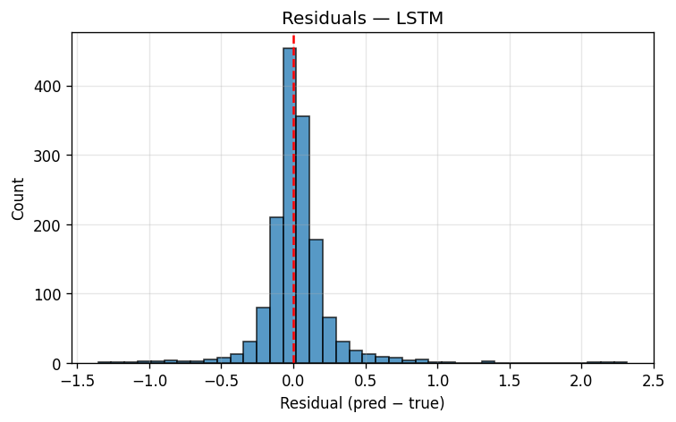

**Observation:** All three models produce zero-centred residuals (no systematic bias). LSTM has the narrowest distribution, FCN is slightly wider, and RNN is widest — consistent with the MSE ranking.

---

## Quickstart

```bash
# 1. Install dependencies
uv sync

# 2. Generate dataset
uv run python -m signal_dataset

# 3. Train all three models & save results
uv run python -m neural_signal

# 3b. Train a single model (fcn | rnn | lstm)
uv run python -m neural_signal --model fcn

# 4. Run tests with coverage
uv run pytest tests/

# 5. Lint (must be zero errors)
uv run ruff check
```

---

## Project Structure

```
HW1/
├── src/
│   ├── signal_dataset/               # Phase 1 — dataset generation
│   │   ├── sdk/sdk.py                # DatasetSDK entry point
│   │   ├── services/
│   │   │   ├── signal_generator.py   # Pure sine wave generation
│   │   │   ├── noise_injector.py     # Gaussian + burst noise
│   │   │   ├── windower.py           # Sliding window + one-hot C
│   │   │   └── dataset_builder.py    # Train/val/test splits → .npz
│   │   └── shared/
│   │       ├── config.py
│   │       ├── gatekeeper.py
│   │       └── version.py
│   └── neural_signal/                # Phase 2 — neural regression
│       ├── sdk/sdk.py                # NeuralSignalSDK entry point
│       ├── models/
│       │   ├── fcn.py                # Fully-connected (Dense 128→64→1)
│       │   ├── rnn.py                # Vanilla RNN (hidden=64, tanh)
│       │   └── lstm.py               # LSTM (hidden=64, dense 32→1)
│       ├── services/
│       │   ├── data_loader.py        # DataLoaderService + DataBundle
│       │   ├── preprocessor.py       # Z-score normalisation
│       │   ├── trainer.py            # Adam + MSE + early stopping
│       │   ├── evaluator.py          # MSE evaluation + CSV table
│       │   ├── visualizer.py         # All result plots (PNG)
│       │   └── sensitivity.py        # OAT hyperparameter sensitivity
│       └── shared/
│           ├── config.py             # ConfigManager + all dataclasses
│           ├── gatekeeper.py         # ApiGatekeeper (rate limits)
│           └── version.py
├── tests/
│   ├── conftest.py                   # Shared fixtures (both packages)
│   ├── unit/                         # 340+ unit tests (TDD)
│   └── integration/                  # End-to-end pipeline tests
├── config/
│   ├── setup.json                    # All parameters (dataset + training)
│   └── rate_limits.json              # API gatekeeper rate limits
├── data/
│   ├── dataset.npz                   # Generated dataset (X, C, y splits)
│   └── signals_raw.npz              # Raw clean + noisy signal vectors
├── results/                          # All generated plots + tables
│   ├── checkpoints/                  # Best model weights (.pt files)
│   ├── clean_noisy_predicted.png
│   ├── mse_comparison.png
│   ├── loss_curves_{fcn,rnn,lstm}.png
│   ├── residuals_{fcn,rnn,lstm}.png
│   ├── pred_vs_actual.png
│   ├── comparison_table.csv
│   └── scaler_params.json
├── docs/
│   ├── PRD.md                        # Product requirements
│   ├── PLAN.md                       # Implementation plan
│   └── TODO.md                       # Task tracking
├── pyproject.toml                    # All dependencies (uv)
└── uv.lock
```

---

## Configuration

All parameters live in `config/setup.json` — **no hardcoded values** in source code.

| Section | Key | Default | Description |
|---------|-----|---------|-------------|
| `dataset` | `duration_sec` | 10 | Signal duration in seconds |
| `dataset` | `sample_rate_hz` | 1000 | Samples per second |
| `dataset` | `window_size` | 10 | Sliding window length |
| `dataset` | `selector_size` | 5 | One-hot vector dimension (4 signals + composite) |
| `dataset` | `train_ratio` | 0.70 | Training split ratio |
| `training` | `batch_size` | 64 | Mini-batch size |
| `training` | `learning_rate` | 0.001 | Adam learning rate |
| `training` | `weight_decay` | 0.0001 | L2 regularisation (FCN only) |
| `training` | `max_epochs` | 200 | Maximum training epochs |
| `training` | `early_stopping_patience` | 10 | Epochs without improvement before stopping |
| `training` | `c_injection_strategy` | broadcast | How C is injected into RNN/LSTM inputs |
| `fcn` | `hidden_sizes` | [128, 64] | Hidden layer dimensions |
| `fcn` | `dropout_rate` | 0.1 | Dropout probability |
| `rnn` | `hidden_size` | 64 | RNN hidden state dimension |
| `rnn` | `input_size` | 6 | Per-timestep features (1 signal + 5 selector) |
| `lstm` | `hidden_size` | 64 | LSTM hidden state dimension |
| `lstm` | `dense_hidden_size` | 32 | Dense head intermediate layer |
| `lstm` | `input_size` | 6 | Per-timestep features |

---

## API Reference

Full documentation for `NeuralSignalSDK` and all service classes: [`docs/api_docs.md`](docs/api_docs.md).

---

## Testing

```bash
uv run pytest tests/          # all tests with coverage report
uv run pytest tests/unit/     # unit tests only
uv run pytest tests/integration/
```

| Metric | Value |
|--------|-------|
| Tests | 377 passed |
| Coverage | 98.37% |
| Threshold | 85% (enforced — build fails below) |

---

## Linting

```bash
uv run ruff check
```

Zero errors enforced across `src/` and `tests/`. Configuration in `pyproject.toml`:
- `select = ["E","F","W","I","N","UP","B","C4","SIM"]`
- `ignore = ["E501"]`
- `line-length = 100`

---

## Design Rationale — Why These Four Signals?

| Signal | Role | Architecture Stress |
|--------|------|---------------------|
| **s1** — 5 Hz, A=2.0 | Dominant slow trend | Period (200 samples) >> window (10 samples); model must infer phase from <5% of a cycle |
| **s2** — 15 Hz, A=1.5, φ=π/4 | Phase-shifted mid-band | Tests whether the model memorises absolute phase vs. infers it from context |
| **s3** — 50 Hz, A=0.8 | High-frequency oscillation | 20 samples/cycle — window covers half a period; exposes RNN vanishing gradient weakness |
| **s4** — 100 Hz, A=0.3 | Near-Nyquist, low amplitude | Only 10 samples/cycle; buried in noise; hardest component to separate |
| **s5** | Composite mixture | Forces conditional source separation — same input, different targets based on C |

This frequency spread (5 → 100 Hz, 20× range) ensures each architecture is tested across different temporal scales, revealing the strengths and weaknesses documented in the comparison above.

---

## Phase 1 Reference

The dataset generation pipeline is documented in [docs/PRD_building_dataset.md](docs/PRD_building_dataset.md),
[docs/PLAN_building_dataset.md](docs/PLAN_building_dataset.md), and
[docs/TODO_building_dataset.md](docs/TODO_building_dataset.md).

---

## Author

Khaled Mnaa — khaled.mnaa43@gmail.com
